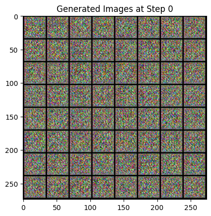
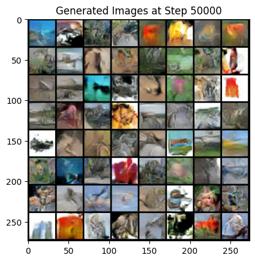
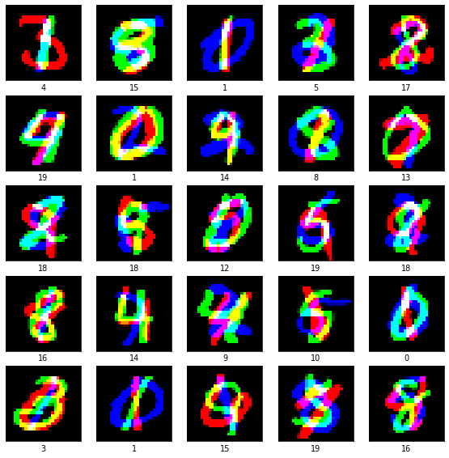
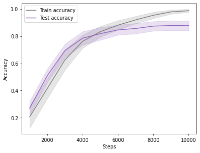
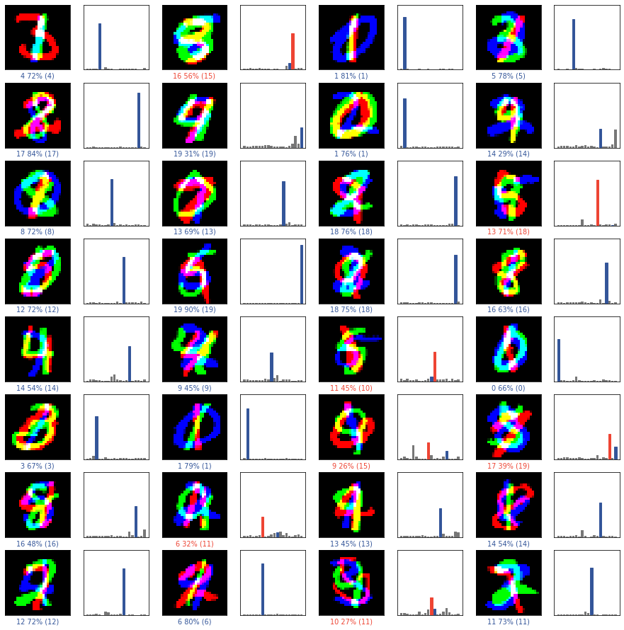
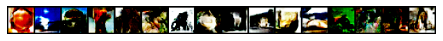

# Constrained Deep Learning: Efficient Discriminative and Generative Modelling

Two deep learning models built under **hard parameter and training-step budgets**, in PyTorch.
The question behind both: how much capability can you extract from a model that is deliberately
too small?

| | Task | Constraint | Result |
|:--|:--|:--|:--|
| **01** | AddNIST classification (20 classes) | < 100k params, ≤ 10k steps | **87.7% ± 3.6%** test accuracy @ 95,652 params |
| **02** | CIFAR-100 image generation | < 1M params, ≤ 50k steps | **FID 59.95** @ 840,588 params |

<p align="center">
  
  
  <br />
  <em>Generator output at step 0 (left) and after the full 50,000-step budget (right).</em>
</p>

<p align="center">
  <a href="#part-1--classification-addnist"></a>
  
  
</p>

---

## Contents

- [Repository structure](#repository-structure)
- [Setup](#setup)
- [Part 1 — Classification (AddNIST)](#part-1--classification-addnist)
- [Part 2 — Generation (CIFAR-100)](#part-2--generation-cifar-100)
- [What I'd do differently](#what-id-do-differently)
- [References](#references)

---

## Repository structure

```
.
├── notebooks/
│   ├── 01_classifier_addnist.ipynb        # ResNet classifier under a 100k-parameter budget
│   └── 02_generative_dcgan_cifar100.ipynb # Spectrally normalised DCGAN under a 1M-parameter budget
├── report/
│   └── technical-report.pdf               # Full write-up: method, ablations, analysis
├── assets/                                # Figures used in this README (exported from notebook outputs)
├── requirements.txt
└── README.md
```

Both notebooks are committed **with their outputs intact**, so you can read the training curves,
sample grids and metrics on GitHub without running anything.

---

## Setup

**Requirements:** Python 3.9+ and, for notebook 02, a CUDA-capable GPU (50,000 GAN steps is
impractical on CPU). Notebook 01 runs on CPU in a reasonable time.

```bash
git clone https://github.com/<your-username>/Deep-Learning.git
cd Deep-Learning

python -m venv .venv
source .venv/bin/activate          # Windows: .venv\Scripts\activate

pip install -r requirements.txt
```

For GPU training, install the CUDA build of PyTorch that matches your driver instead of the
default wheel — see [pytorch.org/get-started/locally](https://pytorch.org/get-started/locally/):

```bash
pip install torch torchvision --index-url https://download.pytorch.org/whl/cu121
```

Then launch Jupyter and run either notebook top to bottom:

```bash
jupyter lab
```

### Data

Nothing needs to be downloaded by hand — both notebooks fetch their own data on first run:

| Notebook | Dataset | Size | Downloaded to |
|:--|:--|:--|:--|
| 01 | [AddNIST](https://data.ncl.ac.uk/articles/dataset/AddNIST/24574354) | ~629 MB | `classification-data/` |
| 02 | CIFAR-100 (via `torchvision`) | ~170 MB | `data/` |

These directories, along with the 10k real/generated image folders used for FID, are
gitignored.

**Runtime:** notebook 01 takes roughly 10 minutes on a modern GPU; notebook 02 takes a few
hours for the full 50,000 steps, plus a few minutes for FID evaluation.

---

## Part 1 — Classification (AddNIST)

**Goal:** classify AddNIST images into 20 classes with **fewer than 100,000 parameters** and
**at most 10,000 training steps**.

<p align="center">
  
  <br />
  <em>AddNIST samples: three MNIST digits stacked as RGB channels, labelled by an arithmetic combination of the three — so the task needs all channels read together, not one digit recognised.</em>
</p>

### Approach

- **Backbone:** custom ResNet — 6 residual blocks, 13 weighted layers, 95,652 parameters
  (96% of the available budget used).
- **Detail-preserving downsampling.** Inputs are only 28×28 and the class signal lives in fine
  detail, so channels stay narrow (16 → 32) and only two blocks use stride 2 — the feature map
  shrinks just twice (28 → 14 → 7) before global average pooling.
- **BatchNorm + ReLU** throughout for stable convergence within a short step budget.
- **Label smoothing (0.25)** on cross-entropy to stop the network becoming overconfident on a
  training set it can nearly memorise.
- **Adam** with a **OneCycle** schedule (max LR 0.004, 40% warm-up, cosine anneal) to get the
  most out of exactly 10,000 steps; per-channel normalisation computed from the training split
  only.

### Results

| Metric | Value |
|:--|:--|
| Parameters | 95,652 / 100,000 |
| Training steps | 10,000 / 10,000 |
| Train accuracy | 98.8% ± 1.0% |
| **Test accuracy** | **87.7% ± 3.6%** |

<p align="center">
  
  
  <br />
  <em>Left: accuracy over the training budget. Right: per-class confidences on test images (blue = correct, red = incorrect).</em>
</p>

**Honest read:** the ~11-point train/test gap is straightforward overfitting. The residual
architecture and label smoothing bought stable, fast convergence, but with the parameter budget
fully spent the remaining gains were in data, not capacity — augmentation is the obvious next
move (see [below](#what-id-do-differently)).

---

## Part 2 — Generation (CIFAR-100)

**Goal:** generate CIFAR-100-like 32×32 images with **fewer than 1,000,000 parameters** and
**at most 50,000 training steps**.

### Approach

- **DCGAN** generator/discriminator pair, 840,588 parameters total (553,644 G + 286,944 D).
- **Spectral normalisation** on every discriminator layer, bounding its Lipschitz constant so
  the discriminator cannot overpower the generator early — the main stability lever here, given
  that a discriminator this small trains much faster than the generator it supervises.
- **LeakyReLU(0.2)** in the discriminator to avoid dead units; **BatchNorm + ReLU** in the
  generator, `tanh` output.
- **Progressive upsampling** 1×1 → 4×4 → 8×8 → 16×16 → 32×32 via transposed convolutions from a
  100-d latent vector.
- **Evaluation:** FID against 10,000 CIFAR-100 test images using `clean-fid` (computed in the
  notebook), plus LPIPS as a diversity measure (reported in the write-up).

### Results

| Metric | Value |
|:--|:--|
| Parameters | 840,588 / 1,000,000 |
| Training steps | 50,000 / 50,000 |
| **FID** ↓ | **59.95** |
| LPIPS (mean ± std) ↑ | 0.5578 ± 0.0722 |

<p align="center">
  
  <br />
  <em>Spherical (slerp) interpolation between two latent vectors — smooth transitions indicate a structured latent space rather than memorised samples.</em>
</p>

**Honest read:** samples show correct global colour statistics and object-like structure, but
remain blurry with limited intra-class variety — the signature of partial mode collapse. At
840k parameters and a fixed step budget that is close to the expected ceiling: the logged losses
settle to a stable equilibrium (Loss_D ≈ 1.35, Loss_G ≈ 0.70) by roughly step 5,000 and barely
move for the remaining 45,000, so most of the budget buys refinement rather than new structure.

---

## What I'd do differently

- **Classifier:** add augmentation (random crops, small rotations, mixup). An early
  augmentation attempt hurt accuracy and was cut for time — with a proper schedule and tuned
  strength it should close most of the train/test gap without costing parameters.
- **GAN:** swap BCE for a hinge or Wasserstein-GP objective, and add a small amount of
  discriminator augmentation. Both target mode collapse directly rather than through
  stabilisation alone.
- **Both:** track a proper validation split for early stopping instead of reporting at the step
  cap, and seed runs for exact reproducibility.

---

## References

- He et al., *Deep Residual Learning for Image Recognition* (2015)
- Radford et al., *Unsupervised Representation Learning with Deep Convolutional GANs* (2015)
- Miyato et al., *Spectral Normalization for Generative Adversarial Networks* (2018)
- Krizhevsky, *Learning Multiple Layers of Features from Tiny Images* — CIFAR-100 (2009)
- Geada et al., *AddNIST Dataset* (2024)

Full citations are in [`report/technical-report.pdf`](report/technical-report.pdf).

Code adapted from external sources is attributed inline in the notebooks:
the ResNet scaffolding follows a
[DigitalOcean tutorial](https://www.digitalocean.com/community/tutorials/writing-resnet-from-scratch-in-pytorch),
the SN-GAN structure follows
[this walkthrough](https://medium.com/%40danushidk507/spectrally-normalized-generative-adversarial-networks-sn-gan-d40b27b5fc8a),
and the slerp helper was drafted with GPT-4o and verified by hand.

---

## Licence

Code is released under the [MIT Licence](LICENSE).
